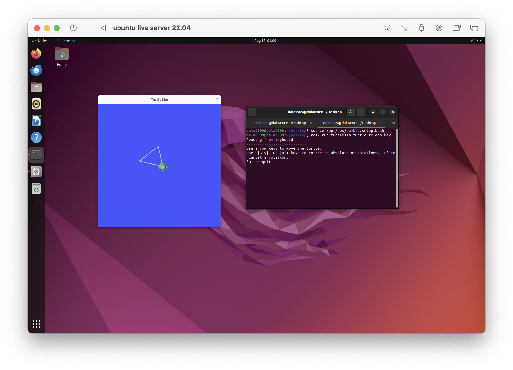
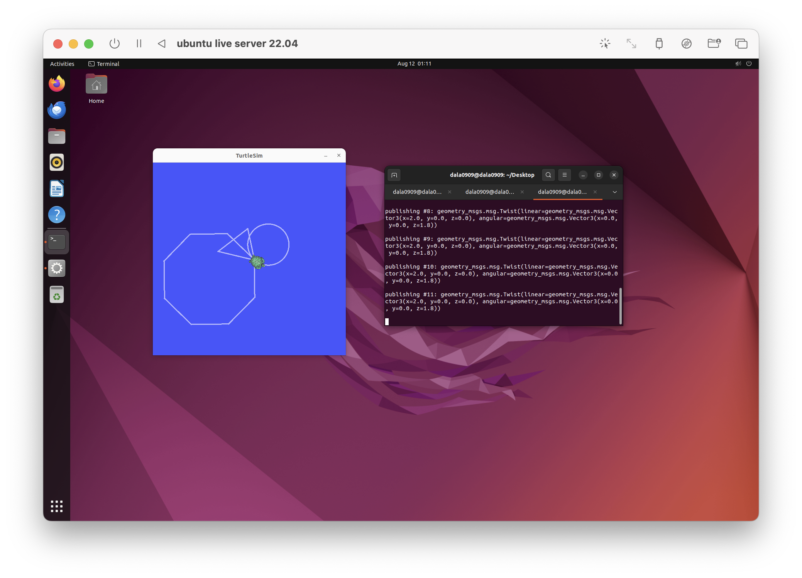

# ROS2 Turtlesim Tasks

Overview

This project demonstrates basic control and drawing shapes using ROS2 Humble and the Turtlesim package.

## Environment Setup
1.	Install ROS2 Humble on Ubuntu.
2.	Install the Turtlesim package:
sudo apt install ros-humble-turtlesim
3.	Run the Turtlesim node:
ros2 run turtlesim turtlesim_node

## Task 1: Keyboard Control

### Steps:
1.	Open a new terminal.
2.	Run the keyboard teleoperation node:
 ros2 run turtlesim turtle_teleop_key
3.	Use arrow keys to move the turtle.

### Screenshots

## Task 2: Drawing a Circle

### Steps:
1.	Open a new terminal.
2.	Publish velocity commands to make the turtle draw a circle:    
ros2 topic pub /turtle1/cmd_vel geometry_msgs/msg/Twist "{linear: {x: 2.0, y: 0.0, z: 0.0}, angular: {x: 0.0, y: 0.0, z: 1.0}}"

### Screenshots

[Circle Video](https://drive.google.com/file/d/1P-8VlQE05_9cRx7TmeO9edwItijmlfGA/view?usp=sharing)

## Task 3: Drawing a Square with Python

### Steps:
1.	Create a Python file square_drawer.py.
2.	Implement the ROS2 Python node to draw a square.
3.	Run the script:  
ros2 run my_package square_drawer

### Screenshots

[Square Video](https://drive.google.com/file/d/1Xuo3SNPzxPFW5p5RtYpKC2yb540wF5ub/view?usp=sharing)

## Repository Contents
• square_drawer.py — Python script for square drawing.
• Screenshots for each task.
• Recordings demonstrating each task.
